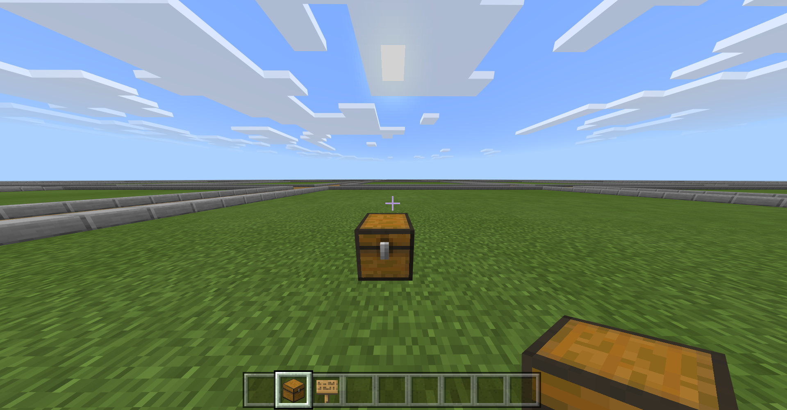
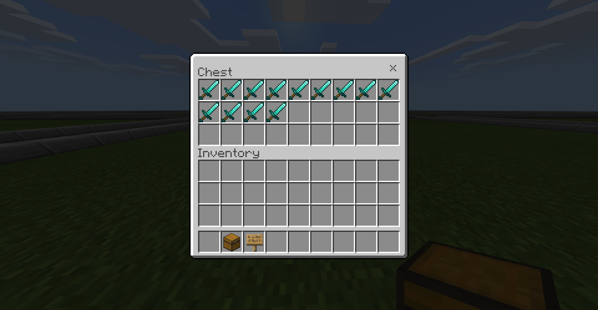
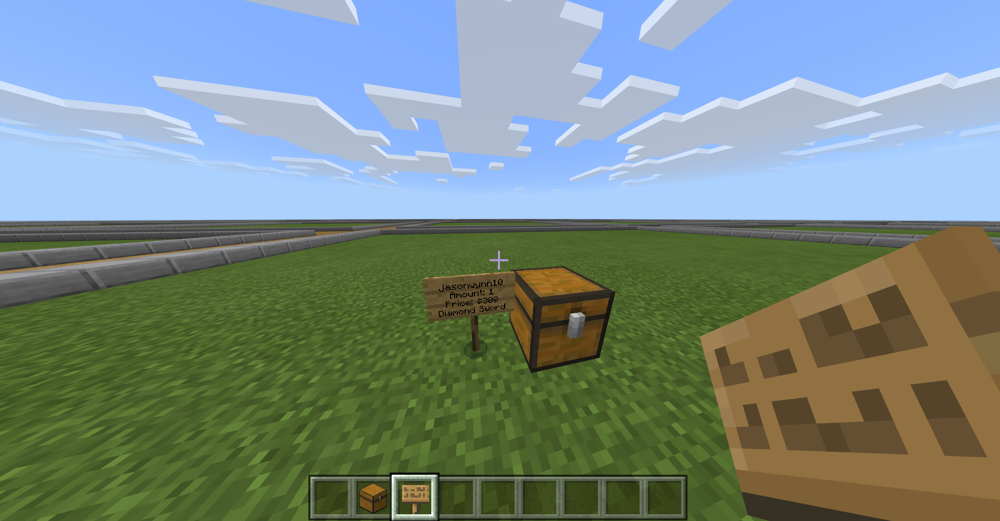

# Intro
ChestShop is a plugin for allowing players to create their own item shops.

# How to use

### Making a shop
1. Place a chest

2. Add items to inventory

3. Place a sign next to or on the chest
4. Set sign text by this format:

  | Line No. | Value |
  | :------: | :---: |
  | 1 | Blank (do not write anything) |
  | 2 | Number you want to sell per transaction |
  | 3 | Price |
  | 4 | Item ID:meta |

5. Profit

### Buying from a shop

1. Tap on the shop sign

# Features
* Player-made chest shops
* Protected shop chests
* Item identifier command
* MultiWorld Support

# Future Additions
* Custom Sign Formats
* Multi-language support
* Multi-Economy Support
* Permissions Support

# About
The Plugin was originally authored by MinecrafterJPN. After completing most of the plugin, they went inactive, now Poggit Orphanage maintains it.